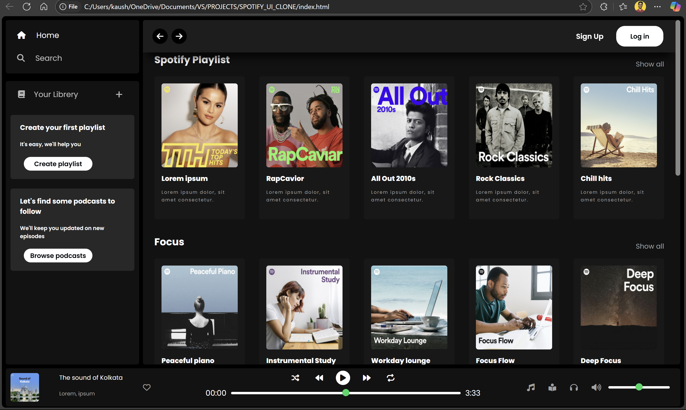

# 🎵 Spotify UI Clone

A responsive clone of the Spotify web player UI, created using **HTML**, **CSS**, **Bootstrap**, and **JavaScript**. This project mimics the look and feel of Spotify’s interface, including the sidebar, playlist cards, media player, and overall layout.

---

## 📸 Screenshot



---

## 🧰 Technologies Used

- ✅ **HTML5**
- ✅ **CSS3**
- ✅ **Bootstrap 5**
- ✅ **JavaScript (Vanilla)**

---

## 🎯 Features

- 🎧 Left sidebar navigation (Home, Search, Your Library)
- 📂 Playlist and podcast section with cards
- 🔊 Media player UI (Play, Pause, Volume control, Track info)
- 📱 Fully responsive layout using Bootstrap grid
- 🖱️ Hover effects and interactive elements

---

## 🚀 Getting Started

To run the project locally:

1. Clone the repository:
```bash
git clone https://github.com/javac2001/SPOTIFY_UI_CLONE.git
